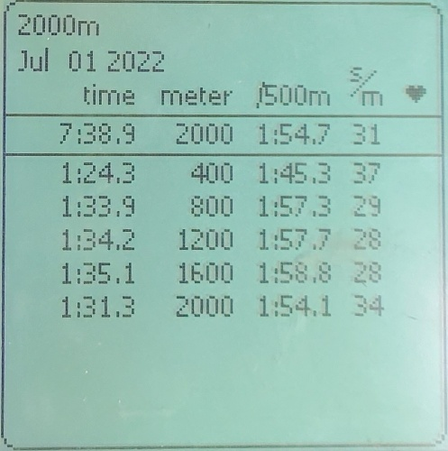

# ergTrack_dash
front end for ergTrack App

## Vision
1. Create an app to track indoor rowing workouts that uses optical character recognition (OCR) to extract workout data from a photo of a Concept2 Erg memory screen removing the need for tedious manual entry. 
2. Provide an easy way for users to search their workout log. 
3. Allow users to compare workouts graphical offering easy visualization of progress. 
4. Add a team feature that gives rowing teams a centralized platform for recording and comparing workout results 

## Motivation 
I built ergTrack as a way to learn full stack development and because it is a product I wanted to use and think other might use too. I realized many people, myself included, keep track of our erg workouts by taking photos of the memory screen and then proceeding to never do anything with those photos. Manually entering data into the Concept2 LogBook is too tedious for most people so I wanted to create an image-to-text app that converts memory screen photos into easily searchable database data. 

### How to Use
* Open the web app: https://ergtrack-dash.onrender.com/ 
* Create User
    * click the 'Menu' button at the top of the page and navigate to the 'Add New User' tab 
    * input and submit user information 
    * click the '⟳' button to relaod the users list
    * Select newly added user from 'Users' dropdown - new user will be at the bottom of the list 
* Add workout from photo
    * After selecting user, navigate to the the 'Add Workout' tab and select 'From Image' 
    * Choose the correct type of workout then click 'Upload'
    * Upload a photograph of a Concept2 Erg memory screen. The image must be cropped such that the top and bottom of the digital black box outline surrounding the workout data line up with the top and and bottom of the photo. You will likely need to crop your image before upload to achieve this. Your uploaded image should look like this: 
    
    
    Note: it may take some time for the image to process. Once processed, a form should appear cotaining the extracted data. The fields are editable so user can manually correct any data that was not accurately extracted. 
    * Submit each part of the workout to the workout table
            * Workouts are broken down into Summary and sub-workouts  
            * The summary shows date, total time, total distance, average split, average stroke rate and average heart rate for the piece
            * If adding an interval workout the sub-workouts will correspond to the intervals. If adding a single distance/time workout, sub-workouts will correspond to sub-sections of that workout. For example a single 2km piece may show sub-workout data for each of the four 500m in that 2000m piece. 
    * Once all sub-workouts have been added click 'submit workout' to add the workout to the ErgTrack database 
* Add workout manually
    * Navigate to 'add workout', select 'Manually'
    * Fill in the workout form with summary and sub-workout data
    * Submit workout to ErgTrack database 
* View, Search and Compare Workouts
        * Navigate to 'Menu' > 'Workout Log'. This page shows the summary data for all workouts assoicated with the selected user
        * VIEW: select a single workout and click 'View Workout Details' to see details about that workout including sub-workout info
        * SEARCH: use the filter data row at the top of the workout log to search for workouts based on any parameter 
        * Compare: Select multiple workouts and click 'Compare' to view a bar chart comparing the splits of each of the selected workouts

## Build Status
### As of 02/22/2023
I removed the app from Render for cost purposes. The app is no longer deployed online. However, you can run the app locally if you desire. 

I am working on a new and impoved version of the ergTrack that will use a React front-end and AWS Textract for OCR. Stay tuned! 

#### As of 11/24/2022
The app is currently deployed at https://ergtrack-dash.onrender.com/ 
### Issues
* OCR fidelity: The OCR extracts data from the photos and generates text but not nearly as accurately as I need to it to. Occasionally the output is perfect, however, more often it is slightly wrong (e.g. 20l,0 instead of 2:01.0) or completely wrong. I suspect variation in lighting and angle between photos is part of the issue - ideal pre-processing parameters for a dark image are not the same as for a light one. However, this is definitely not the whole problem.
* OCR time: I need to speed up the OCR time. The time to complete OCR differs depending on device and deployment environment. When run locally on my computer it takes less than 5 seconds. Using my phone and the render deployed version it can take over 30 seconds. 
* Image cropping: for the OCR to work, images must be cropped such that the top and bottom of the box  outlining the memory screen data line up with the top and bottom of the photograph as shown in the image above. This is inconvinient for users as it requires them to pre-process their image. Ideally I could automatically detect the perimeter box and crop the image accordingly. However, so far my attempts to do this have failed. 

### Incomplete Features
* Workout Comparison: Currently user can select and compare multiple workouts but the comparison graph that is generated isn't formatted in a meaningful way 
* Team: at sign up user can include which team they are a part of. However, I have not yet created any team specific features 
* Edit workouts: feature not yet added 
* Secure Login: feature not yet added. Currently users are simply selected from a dropdown menu. This means anyone can access any user. 

